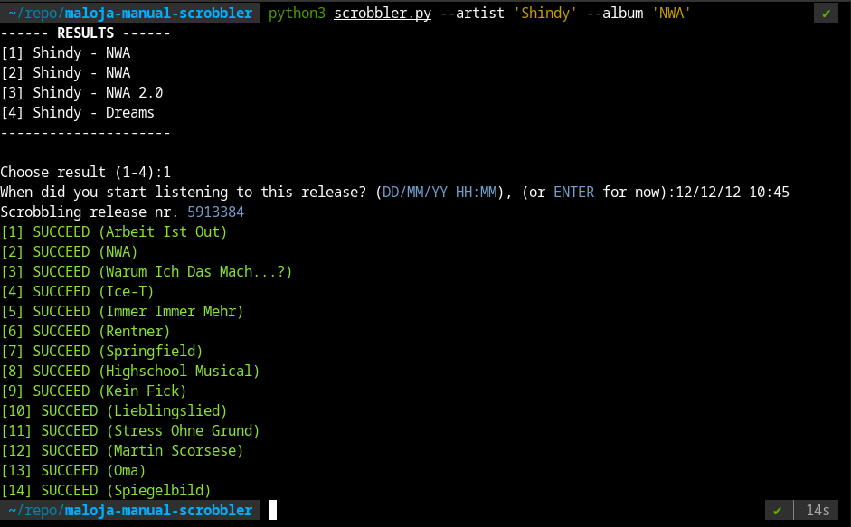

Maloja Manual Scrobbler is a Python script for manually scrobbling albums to your Maloja instance using data from Discogs.

## Table of Contents

1. [Installation](#installation)
2. [Usage](#usage)
3. [Arguments](#arguments)
4. [Setting Up API Keys](#setting-up-api-keys)
5. [License](#license)

## Installation

1. **Clone the Repository:**
   
   ```bash
   git clone https://github.com/your_username/maloja-manual-scrobbler.git
   ```
   
2. **Install Dependencies:**
   ```bash
   pip install -r requirements.txt
   ```

## Usage

Run the script using Python. Here's an example:



## Arguments

- `-ar, --artist`: The name of the artist.
- `-al, --album`: The name of the album.
- `-r, --release`: The release ID of the album on Discogs. (optional)
- `-d, --date`: The date and time when you started listening to the album (optional).

## Setting Up API Keys

Before using the script, you need to set your Discogs token and Maloja API key inside the script. Look for the following lines:

```python
DISCOGS_TOKEN="YOUR_DISCOGS_TOKEN"
MALOJA_URL="YOUR_MALOJA_URL"
MALOJA_API_KEY="YOUR_MALOJA_API_KEY"
```

Replace `"YOUR_DISCOGS_TOKEN"`, `"YOUR_MALOJA_URL"`, and `"YOUR_MALOJA_API_KEY"` with your actual Discogs token, Maloja URL, and Maloja API key, respectively.

## License

This project is licensed under the [GNU General Public License v3.0](LICENSE).
